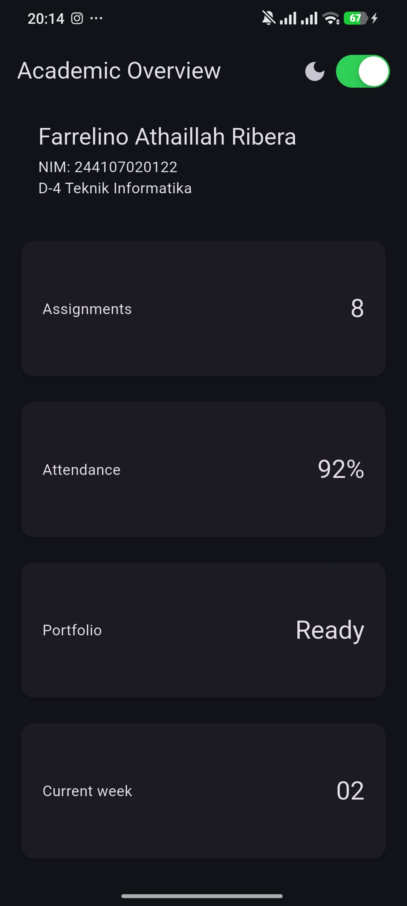
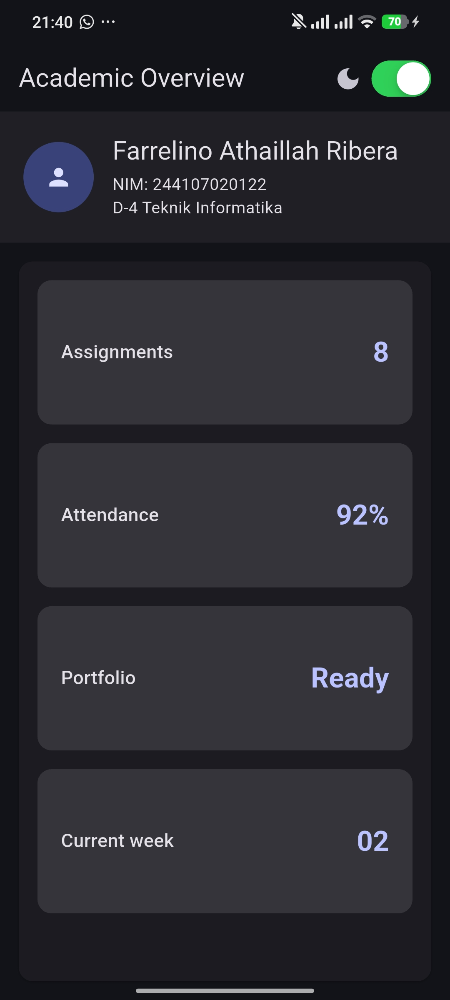

ai prompt 

1.  "Bandingkan dua tata letak dashboard akademik untuk Flutter: versi GridView dan versi LayoutBuilder + Column. Jelaskan trade-off responsif dan aksesibilitasnya."
Berikut perbandingannya dalam konteks dashboard akademik Flutter:

| Aspek             | `GridView`                                                   | `LayoutBuilder + Column`                                                                     |
| ----------------- | ------------------------------------------------------------ | -------------------------------------------------------------------------------------------- |
| **Struktur**      | Langsung menampilkan kartu dalam grid                        | Mengatur layout berdasarkan ukuran layar, lalu membagi area dengan `Column`                  |
| **Responsif**     | Bisa responsif jika `crossAxisCount` ditentukan dengan tepat | **Lebih fleksibel**, karena jumlah kolom bisa ditentukan berdasarkan `constraints.maxWidth`  |
| **Layar sempit**  | Perlu pengaturan agar kartu tidak terlalu kecil              | Mudah dibuat 1 kolom pada layar sempit                                                       |
| **Layar lebar**   | Bisa 2+ kolom, tetapi perlu aturan tambahan                  | Mudah menentukan 2 kolom saat lebar layar mencapai breakpoint                                |
| **Header profil** | Kurang cocok jika seluruh halaman hanya berupa grid          | **Lebih cocok**, karena `Column` bisa menampung header, profil, lalu grid                    |
| **Scrolling**     | `GridView` sudah mendukung scrolling                         | `Column` sendiri tidak scrolling; biasanya `GridView` ditempatkan di dalam `Expanded`        |
| **Aksesibilitas** | `Semantics` dapat ditambahkan pada setiap kartu              | Sama-sama bisa menggunakan `Semantics`; struktur `Column` memudahkan pengelompokan informasi |
| **Kompleksitas**  | Lebih sederhana untuk dashboard yang hanya berisi kartu      | Sedikit lebih kompleks, tetapi lebih mudah dikembangkan                                      |
| **Cocok untuk**   | Dashboard sederhana dengan banyak kartu                      | Dashboard akademik yang memiliki profil, header, kontrol tema, dan kartu                     |

### Trade-off responsif

`GridView` lebih **sederhana**. Misalnya:

```dart
GridView.count(
  crossAxisCount: 2,
  children: [...],
)
```

Namun, jumlah kolomnya tetap 2. Pada layar yang sempit, kartu bisa menjadi terlalu kecil.

Sedangkan `LayoutBuilder + Column` memungkinkan kita membaca lebar layar:

```dart
final columns = constraints.maxWidth >= 900 ? 2 : 1;
```

Kemudian:

* **< 900 px** → 1 kolom
* **≥ 900 px** → 2 kolom

Ini lebih cocok untuk dashboard akademik karena tampilan dapat menyesuaikan perangkat, baik HP maupun tablet/laptop.

### Trade-off aksesibilitas

Keduanya sebenarnya **sama-sama bisa accessible**. Yang paling penting bukan jenis layout-nya, tetapi bagaimana widget diberi informasi semantik.

Contohnya pada kartu:

```dart
Semantics(
  label: 'Attendance: 92%',
  child: Card(
    ...
  ),
)
```

Screen reader dapat membacakan informasi kartu dengan lebih jelas.

Pada `LayoutBuilder + Column`, kita juga dapat mengelompokkan bagian-bagian penting seperti **profil mahasiswa, kontrol dark mode, dan kartu akademik** secara lebih terstruktur. Misalnya, switch dapat diberi:

```dart
Semantics(
  label: 'Dark mode',
  hint: 'Aktifkan atau nonaktifkan mode gelap',
  child: CupertinoSwitch(
    value: isDark,
    onChanged: onDarkChanged,
  ),
)
```

### Kesimpulan

Untuk **dashboard yang hanya berisi kumpulan kartu**, `GridView` lebih sederhana dan praktis. Namun, untuk **dashboard akademik yang memiliki header profil, informasi mahasiswa, dark-mode switch, dan kartu informasi**, pendekatan **`LayoutBuilder + Column` lebih unggul** karena memberikan kontrol responsif yang lebih baik tanpa mengorbankan aksesibilitas.

Dalam kasus tugasmu, struktur **`LayoutBuilder → Column → Container profil → Expanded → GridView`** adalah pilihan yang paling sesuai karena memenuhi kebutuhan responsif sekaligus memungkinkan setiap informasi penting diberi `Semantics`.


2. "Jelaskan kapan penggunaan Expanded justru menyebabkan overflow di dalam Row, beri contoh kode yang gagal dan perbaikannya."

`Expanded` di dalam `Row` **bisa menyebabkan overflow** ketika ruang horizontal yang tersedia tidak cukup, terutama jika ada widget lain yang memiliki **lebar tetap terlalu besar** atau beberapa widget dipaksa mengambil ruang secara bersamaan.

### Contoh kode yang gagal

Misalnya:

```dart
Row(
  children: [
    Expanded(
      child: Text(
        'Nama mahasiswa yang sangat panjang sekali...',
      ),
    ),
    Container(
      width: 300,
      child: Text('Informasi tambahan yang panjang'),
    ),
  ],
)
```

Masalahnya, `Container` membutuhkan **300 px**, sementara `Expanded` juga mencoba menggunakan sisa ruang. Jika total kebutuhan melebihi lebar layar, Flutter dapat menghasilkan:

```text
A RenderFlex overflowed by ... pixels on the right.
```

### Perbaikannya

Salah satu solusi adalah memberikan batasan pada widget yang panjang dan membiarkan `Expanded` mengatur sisa ruang:

```dart
Row(
  children: [
    Expanded(
      child: Text(
        'Nama mahasiswa yang sangat panjang sekali...',
        overflow: TextOverflow.ellipsis,
      ),
    ),
    const SizedBox(width: 8),
    Flexible(
      child: Text(
        'Informasi tambahan yang panjang',
        overflow: TextOverflow.ellipsis,
      ),
    ),
  ],
)
```

Di sini `Flexible` lebih tepat jika widget kedua **tidak harus mengambil seluruh sisa ruang**.

### Contoh yang lebih sederhana

`Expanded` juga bermasalah jika kita memasukkannya ke dalam `Row` yang berada di dalam area dengan ukuran horizontal yang tidak terbatas.

Contohnya:

```dart
SingleChildScrollView(
  scrollDirection: Axis.horizontal,
  child: Row(
    children: [
      Expanded(
        child: Text('Nama mahasiswa'),
      ),
    ],
  ),
)
```

Ini tidak tepat karena `Row` di dalam horizontal `SingleChildScrollView` dapat memperoleh **unbounded width**, sedangkan `Expanded` membutuhkan ruang yang terbatas untuk menentukan ukurannya.

Perbaikannya:

```dart
SingleChildScrollView(
  scrollDirection: Axis.horizontal,
  child: Row(
    children: [
      Text('Nama mahasiswa'),
    ],
  ),
)
```

### Intinya

**`Expanded` bukan penyebab overflow secara otomatis.** Justru `Expanded` biasanya membantu mencegah overflow dengan mengambil ruang yang tersedia. Overflow terjadi ketika kita memberikan kombinasi constraint yang tidak cocok, misalnya:

> `Row` + widget berukuran tetap terlalu besar + `Expanded`, atau `Expanded` berada di dalam parent dengan ukuran tidak terbatas.

Untuk dashboard akademikmu, penggunaan seperti ini justru **tepat**:

```dart
Row(
  children: [
    const CircleAvatar(),
    const SizedBox(width: 16),
    Expanded(
      child: Column(
        crossAxisAlignment: CrossAxisAlignment.start,
        children: [
          Text('Farrelino Athaillah Ribera'),
          Text('NIM: 244107020122'),
          Text('D-4 Teknik Informatika'),
        ],
      ),
    ),
  ],
)
```

`CircleAvatar` mengambil ruang secukupnya, sedangkan `Expanded` memberikan **sisa lebar** kepada informasi profil. Jadi nama yang panjang tidak langsung memaksa `Row` melewati batas layar.


3.  "Periksa kembali rekomendasi layout di atas: apakah tetap responsif di bawah 600px, apakah mengurangi aksesibilitas, dan apakah ada widget yang tidak tersedia di Flutter stabil saat ini?"


Setelah diperiksa lagi berdasarkan dokumentasi Flutter terbaru, **rekomendasi layout sebelumnya pada dasarnya masih valid**, tetapi ada beberapa catatan penting.

### 1. Apakah tetap responsif di bawah 600 px?

**Ya, jika breakpoint-nya dibuat dengan benar.** Flutter sendiri menggunakan contoh breakpoint **600 px** untuk membedakan layout besar dan kecil. `LayoutBuilder` memang dirancang untuk membaca `constraints.maxWidth` dan memilih layout berdasarkan ruang yang benar-benar tersedia. ([Dokumentasi Flutter][1])

Pada kode kita:

```dart
final columns = constraints.maxWidth >= 900 ? 2 : 1;
```

berarti:

* `< 900 px` → **1 kolom**
* `≥ 900 px` → **2 kolom**

Jadi pada **600 px, 500 px, bahkan 360 px**, dashboard tetap menggunakan 1 kolom.

Namun ada catatan: **responsif bukan hanya jumlah kolom**. Header profil juga harus mampu mengecil. Penggunaan `Expanded` pada teks profil sudah tepat karena memberikan sisa ruang kepada teks. Flutter menjelaskan bahwa `Expanded` membuat child menggunakan ruang yang tersedia dalam `Row`. ([Dokumentasi Flutter][2])

---

### 2. Apakah `Expanded` + `Column` mengurangi aksesibilitas?

**Tidak secara otomatis.**

`Column`, `Row`, `Expanded`, dan `GridView` adalah widget layout biasa. Aksesibilitas lebih bergantung pada apakah informasi penting dan kontrol interaktif diberi label yang bermakna.

Pada kode kita, penggunaan:

```dart
Semantics(
  label: 'Dark mode',
  hint: 'Aktifkan atau nonaktifkan mode gelap',
  child: CupertinoSwitch(
    value: isDark,
    onChanged: onDarkChanged,
  ),
)
```

sudah merupakan pendekatan yang baik.

Kartu juga bisa diberi:

```dart
Semantics(
  label: '$title: $value',
  child: Card(
    ...
  ),
)
```

Sehingga screen reader dapat memahami bahwa kartu tersebut misalnya berisi **"Attendance: 92%"**, bukan sekadar membaca widget secara terpisah.

Jadi **`LayoutBuilder + Column` tidak mengurangi aksesibilitas** selama struktur semantiknya tetap jelas.

---

### 3. Apakah ada widget yang tidak tersedia di Flutter stable?

**Tidak ada masalah dengan widget yang kita gunakan.**

Widget seperti:

* `LayoutBuilder`
* `Column`
* `Row`
* `Expanded`
* `Container`
* `GridView`
* `Semantics`
* `CupertinoSwitch`
* `CircleAvatar`

tersedia di Flutter stable. Dokumentasi Flutter saat ini bahkan mendokumentasikan `LayoutBuilder`, `Expanded`, `GridView`, dan widget layout lainnya sebagai bagian dari Flutter. ([Dokumentasi Flutter][3])

`CupertinoSwitch` juga merupakan bagian dari library Cupertino Flutter dan tersedia secara resmi. ([Dokumentasi Flutter][4])

Dokumentasi resmi yang saya cek saat ini mencerminkan **Flutter 3.47.2**, jadi pendekatan tersebut bukan menggunakan widget eksperimental atau API yang hanya tersedia di versi tertentu. ([Dokumentasi Flutter][1])

### 4. Satu perbaikan yang saya rekomendasikan

Untuk tugasmu, struktur ini sudah bagus:

```text
Scaffold
 ├── AppBar
 │    ├── Academic Overview
 │    └── CupertinoSwitch
 │
 └── LayoutBuilder
      └── Column
           ├── Container
           │    └── Row
           │         ├── CircleAvatar
           │         └── Expanded
           │              └── Column
           │                   ├── Nama
           │                   ├── NIM
           │                   └── Prodi
           │
           └── Expanded
                └── GridView
                     ├── Assignment
                     ├── Attendance
                     ├── Portfolio
                     └── Current Week
```

**Kesimpulan:** layout yang kita buat **tetap responsif di bawah 600 px, tidak mengurangi aksesibilitas, dan menggunakan widget yang tersedia di Flutter stable saat ini**. Bahkan, pola `LayoutBuilder` + breakpoint + `Expanded` + `GridView` sejalan dengan pola adaptive layout yang direkomendasikan dokumentasi Flutter. ([Dokumentasi Flutter][1])

Satu hal yang perlu kamu waspadai adalah **tinggi layar yang sangat kecil** (misalnya landscape HP). Karena profil + grid berada dalam `Column`, `Expanded` sudah membantu grid mengambil sisa ruang dan `GridView` menangani scrolling. Itu justru pilihan yang cukup aman untuk kasus tugasmu. ([Dokumentasi Flutter][2])

[1]: https://docs.flutter.dev/learn/pathway/tutorial/adaptive-layout?utm_source=chatgpt.com "LayoutBuilder and adaptive layouts"
[2]: https://docs.flutter.dev/ui/layout?utm_source=chatgpt.com "Layouts in Flutter"
[3]: https://docs.flutter.dev/ui/widgets/layout?utm_source=chatgpt.com "Layout widgets"
[4]: https://docs.flutter.dev/ui/design/cupertino?utm_source=chatgpt.com "Cupertino design for Flutter"


Flutter test : 

flutter analyze                  
Analyzing responsive_dashboard...                                       
No issues found! (ran in 35.0s)

flutter test
00:03 +2: All tests passed!                        

## Screenshot




                                                                            