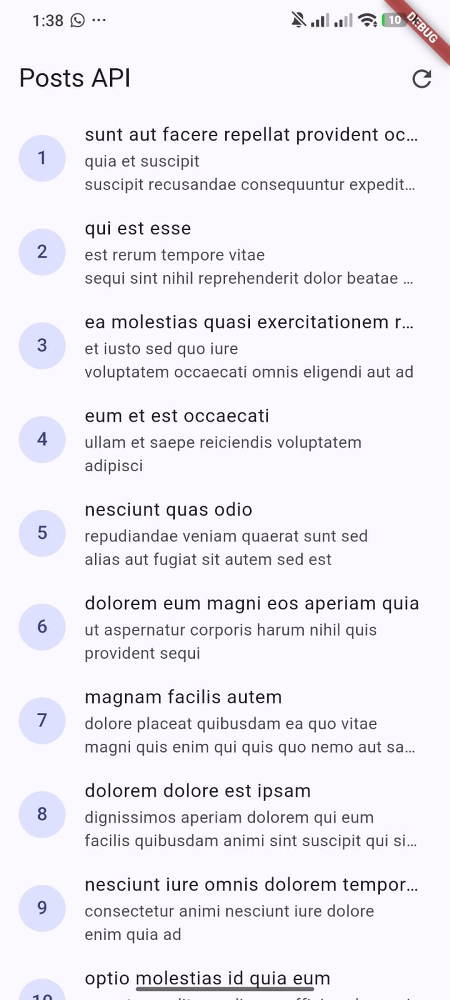

Uji tiga skenario error

1. Jalankan aplikasi dengan internet normal, amati loading lalu daftar 100 posts.

2. Matikan internet (mode pesawat), tekan refresh, amati pesan ramah + tombol Coba lagi. Nyalakan kembali internet, tekan Coba lagi.
 
3. Sementara ubah baseUrl menjadi URL salah, amati pesan error koneksi. Kembalikan setelah uji.
 

 