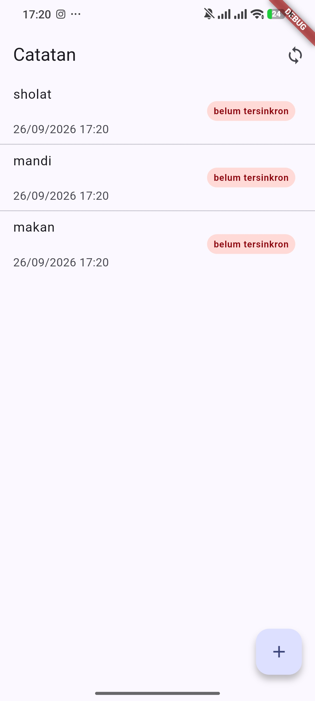
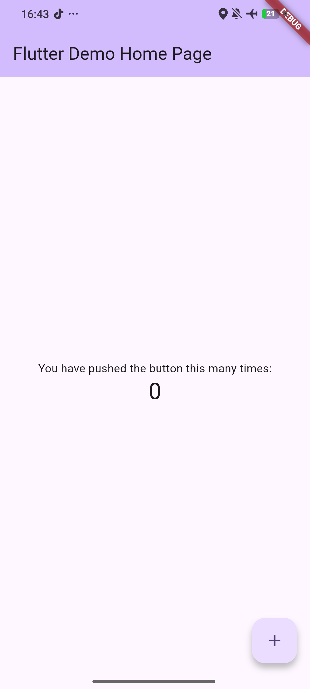

# Offline Notes

Aplikasi catatan dengan fokus penyimpanan lokal dan pola offline first
untuk praktikum Pemrograman Mobile Minggu 5.

## Tujuan

Membangun aplikasi catatan yang tetap berfungsi tanpa koneksi internet
dengan memakai penyimpanan lokal (SQLite dan SharedPreferences), sekaligus
menerapkan dua mekanisme offline first:

1. Cache first untuk data API. Daftar posts dari JSONPlaceholder dijawab
   seketika dari cache lokal saat offline, lalu diperbarui di background
   ketika jaringan tersedia.
2. Sinkronisasi catatan kotor (dirty). Catatan yang dibuat/diubah offline
   diberi flag dirty, lalu disinkronkan dan ditandai bersih.

## Fitur Utama

- CRUD catatan lokal dengan SQLite (tambah via dialog, daftar, dan detail read only).
- Badge "belum tersinkron" pada catatan yang masih bertanda dirty.
- Halaman detail catatan via route `/note/:id` yang membaca langsung dari repository.
- Tombol sinkronisasi catatan kotor dengan simulasi upload dan penandaan bersih.
- Pola cache first untuk data API dengan penyimpanan ulang cache di background.
- Preferensi tema via SharedPreferences (infrastruktur provider dark mode telah disiapkan).

## Stack Teknologi

- Flutter dan Dart.
- Riverpod 3 (AsyncNotifier dan FutureProvider) untuk manajemen state.
- GoRouter untuk navigasi berbasis URL.
- Dio untuk HTTP API JSONPlaceholder.
- sqflite untuk database lokal.
- shared_preferences untuk preferensi.

## Cara Menjalankan

1. Instal dependency: `flutter pub get`.
2. Jalankan di perangkat Android: `flutter run -d 24094RAD4G`
   (ganti dengan id perangkat Anda dari `flutter devices`).

Catatan build (troubleshooting): jika Gradle gagal pada task
`compileDebugKotlin` dengan pesan "Storage ... is already registered"
(bug Kotlin daemon di JDK 25), matikan incremental Kotlin dan turunkan
beban memori JVM di `android/gradle.properties` sesuai yang sudah
diterapkan di proyek ini:

```properties
org.gradle.jvmargs=-Xmx4G -XX:MaxMetaspaceSize=1G -XX:ReservedCodeCacheSize=512m -XX:+HeapDumpOnOutOfMemoryError
kotlin.incremental=false
```

## Hasil yang Dicapai

- `flutter analyze`: No issues found.
- `flutter test`: 14 test lulus.
- Build dan instalasi ke perangkat Android berhasil.




## Hasil Praktikum



Keterangan: angka jumlah catatan yang disinkronkan tetap 0 dan tidak berubah. Belum ada catatan bertanda dirty, sehingga countDirty mengembalikan 0 dan syncNotes langsung keluar dengan hasil 0 tanpa menandai apapun, maka angka pada tampilan tidak berubah.

## Refleksi

Mengapa data API memakai pola cache first dibanding network first?
Karena UI tidak pernah blank saat offline. Cache lokal dijawab seketika, lalu refresh di background memperbarui dan menyimpan hasil terbaru. Network first memaksa menunggu jaringan sehingga gagal total saat modus pesawat.

Mengapa sinkronisasi memakai flag dirty dan bukan langsung mengubah status?
Karena flag dirty menjadi semacam antrean. Semua catatan yang belum terkirim tetap tersimpan di database, sehingga jika proses terputus kita tahu persis mana yang harus diulang. Di project nyata, markAllSynced hanya dijalankan bila server menjawab 2xx.

Mengapa sqflite untuk catatan dan SharedPreferences untuk preferensi?
Catatan butuh query, urutan, dan indeks untuk ratusan baris, sehingga SQLite lebih cocok. Preferensi hanya satu nilai boolean, sehingga SharedPreferences lebih ringkas tanpa boilerplate, sesuai rekomendasi AI Challenge.

Mengapa halaman detail membaca dari repository, bukan dari state halaman list?
Agar halaman detail mandiri dan bisa dibuka langsung melalui route /note/:id tanpa bergantung halaman daftar. Ini juga yang membuat navigasi berbasis URL bekerja untuk deep link.

Bagian mana dari hasil AI yang saya perbaiki, dan mengapa?
AI Challenge merekomendasikan sqflite dan SharedPreferences yang saya ikuti. Pada implementasi saya menambahkan retry null pada AsyncNotifier (Riverpod 3 default me retry dan membuat test menggantung), menambahkan fetchNote untuk detail yang membaca repository, dan mengganti test template Counter yang rusak dengan unit test dan widget test yang benar benar relevan.


## AI Challenge

Aplikasi Flutter Offline Notes: CRUD catatan + preferensi tema.
Bandingkan SharedPreferences, Hive, sqflite (SQLite), dan Drift
untuk dua kebutuhan ini. Requirements:
- Kriteria: kompleksitas query, kebutuhan relasi, reaktivitas (stream),
  type-safety, ukuran boilerplate, dan kemudahan testing.
- Beri rekomendasi final: mana untuk preferensi, mana untuk catatan,
  beserta alasannya dalam 1 tabel.
- Tunjukkan skema tabel/kotak untuk 1000+ catatan.
Jelaskan trade-off setiap pilihan.


### Jawaban

Konteks: preferensi tema (satu nilai kecil) dan CRUD ribuan catatan.

### Perbandingan kriteria

| Kriteria | SharedPreferences | Hive | sqflite (SQLite) | Drift |
|---|---|---|---|---|
| Kompleksitas query | tidak ada (get/set kunci) | sangat sederhana (baca seluruh box lalu filter manual) | SQL penuh (WHERE, JOIN, ORDER, LIMIT) | SQL atau query builder type-safe |
| Kebutuhan relasi | tidak ada | tidak ada | ya (FOREIGN KEY dan JOIN) | ya (FK dan relasi otomatis) |
| Reaktivitas (stream) | tidak ada | ada, box.watch() per key | tidak bawaan, harus re-query manual | watch() bawaan per query |
| Type-safety | rendah (dynamic) | rendah, type adapter opsional | rendah (Map dynamic) | tinggi, kelas hasil dari codegen |
| Ukuran boilerplate | paling kecil | kecil sampai medium (adapter tipe custom) | medium (string SQL plus mapping manual) | besar di setup (build_runner), kecil per fitur sesudahnya |
| Kemudahan testing | mudah, mock SharedPreferences | mudah, box di folder temp atau in-memory | mudah sampai medium, sqflite_common_ffi untuk in-memory | mudah, NativeDatabase.memory |

### Rekomendasi final

| Kebutuhan | Pilihan | Alasan |
|---|---|---|
| Preferensi tema | SharedPreferences | Satu nilai boolean berkunci tetap, tanpa query, relasi, maupun stream. API sinkron paling sederhana, nol dependency, paling hemat untuk data konfigurasi kecil. |
| 1000+ catatan (CRUD) | sqflite (SQLite) | Butuh query nyata: cari, urut berdasarkan waktu, filter, transaksi, dan indeks. SQLite matang tanpa tambahan codegen. Drift layak dinaikkan bila nanti butuh reaktivitas dan type-safety bawaan. |

### Trade-off setiap pilihan

- SharedPreferences untuk catatan tidak cocok karena tidak ada query maupun indeks. Memuat 1000+ catatan berarti deserialisasi seluruh file, tidak efisien dan sulit dipaginasi.
- Hive sangat cepat untuk nilai tunggal tetapi tanpa query berarti seluruh list dimuat dan difilter manual di memori. Ekosistem Hive v2 praktis usang (pengembang aslinya pindah ke Isar), sehingga berisiko sebagai fondasi data utama.
- sqflite tidak reaktif, mapping manual, dan type-safety rendah. Kelebihannya SQL penuh, dependency ringan, dan sudah terpakai di proyek ini sehingga cukup untuk offline-first.
- Drift terbaik untuk type-safety, stream, dan relasi tanpa string SQL yang rentan salah, tetapi menambah build_runner dan kurva belajar. Berlebihan untuk penyimpanan satu boolean tema.

### Skema untuk 1000+ catatan

```sql
CREATE TABLE notes (
  id         INTEGER PRIMARY KEY AUTOINCREMENT,
  title      TEXT    NOT NULL,
  body       TEXT    NOT NULL DEFAULT '',
  updated_at INTEGER NOT NULL,                 -- epoch millis, ringkas dan bisa range scan
  dirty      INTEGER NOT NULL DEFAULT 0,       -- 0/1 untuk sinkronisasi offline
  is_pinned  INTEGER NOT NULL DEFAULT 0
);

-- Indeks untuk sorting dan filter umum (daftar rumah, sync, pin)
CREATE INDEX idx_notes_updated ON notes (updated_at DESC);
CREATE INDEX idx_notes_pinned_dirty ON notes (is_pinned, dirty);

-- Opsional relasi one-to-many (tag) dengan FK dan JOIN
CREATE TABLE tags (
  id   INTEGER PRIMARY KEY,
  name TEXT NOT NULL UNIQUE
);
CREATE TABLE note_tags (
  note_id INTEGER NOT NULL REFERENCES notes (id) ON DELETE CASCADE,
  tag_id  INTEGER NOT NULL REFERENCES tags (id)  ON DELETE CASCADE,
  PRIMARY KEY (note_id, tag_id)
);

-- Opsional pencarian teks cepat (FTS5) untuk ribuan catatan
CREATE VIRTUAL TABLE notes_fts USING fts5(
  title, body, content=notes, content_rowid=id
);
```

Catatan: proyek ini menyimpan updated_at sebagai TEXT ISO8601 via DateTime.toIso8601String. Untuk skala 1000+ sebaiknya INTEGER epoch millis karena lebih ringkas dan bisa dibandingkan numerik langsung di SQL.


## AI Verification Checklist
Sebelum rekomendasi AI diterima, verifikasi dan catat temuan Anda di README:

Apakah AI menempatkan daftar catatan di SharedPreferences? (menolak: rapuh untuk koleksi).
Apakah skema AI mendukung antrean sync (dirty flag / updated_at) atau hanya CRUD polos?
Apakah klaim "real-time" AI didukung stream (Drift/watch) atau hanya asumsi?
Apakah estimasi boilerplate AI masuk akal setelah Anda mencoba instalasinya (flutter pub add + migrasi skema)?
Keputusan final Anda beserta alasannya, boleh berbeda dari rekomendasi AI selama berargumen.


## Hasil Verifikasi

1. AI tidak menempatkan daftar catatan di SharedPreferences. Lulus. Rekomendasi hanya menaruh boolean tema di SharedPreferences dan menolak SharedPreferences untuk koleksi karena tidak ada query maupun indeks, sehingga rapuh untuk daftar besar.
2. Skema AI mendukung antrean sync. Lulus. Skema menyertakan kolom dirty dan updated_at plus indeks, bukan CRUD polos. Konsisten dengan implementasi aktual di note_repository.dart (countDirty, markAllSynced, dan addNote yang menyetel dirty true).
3. Klaim stream pada Drift dan Hive didukung dokumentasi API resmi, bukan hasil uji lokal karena package tersebut belum diinstal di proyek. Aplikasi saat ini tidak memakai stream sama sekali, refresh cache-first memakai background fetch lalu ref.invalidateSelf di providers.dart.
4. Estimasi boilerplate belum diverifikasi dengan instalasi nyata. Berdasarkan pengalaman umum, setup Drift membutuhkan build_runner dan codegen, sedangkan sqflite menuntut mapping manual dengan string SQL. Secara kualitatif masuk akal, tetapi tidak diuji dengan flutter pub add maupun migrasi skema di proyek ini.

Keputusan final: tetap memakai sqflite untuk catatan dan SharedPreferences untuk preferensi. Alasannya proyek offline-first tidak membutuhkan stream dan cukup dengan refresh manual, dan sqflite sudah terinstal sehingga tidak menambah codegen.