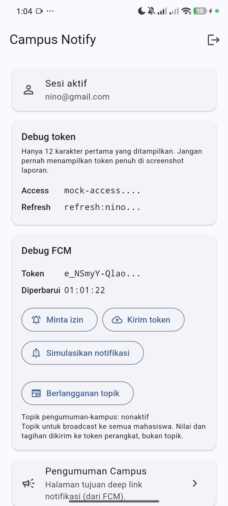

# Week 6 — Authentication, Security & FCM

Campus Notify: aplikasi notifikasi pengumuman kampus dengan login terlindungi,
penyimpanan token aman, dan Firebase Cloud Messaging.

## Tujuan

- Menjelaskan alur autentikasi dan perbedaan ID token, access token, dan refresh token.
- Menyimpan token di secure storage dengan token refresh otomatis.
- Mengelola FCM: permission, token lifecycle, tiga app state, dan topic messaging.

## Fitur Utama

| Fitur | Implementasi |
|---|---|
| Login + guard route | GoRouter `redirect`, belum login selalu ke `/login` |
| Penyimpanan token aman | `flutter_secure_storage` (Keychain/Keystore), bukan SharedPreferences |
| Refresh otomatis | Dio interceptor mencoba refresh **sekali** saat 401, lalu mengulang request |
| Logout paksa | Refresh token ditolak → secure storage dikosongkan → guard ke `/login` |
| Permission notifikasi | Jalur terpisah Android (plugin) dan iOS (`requestPermission`) |
| Token lifecycle | `getToken()` + listener `onTokenRefresh` (wajib) |
| Topic messaging | Subscribe/unsubscribe `pengumuman-kampus` |
| Deep link | `data.route` → `routeFromMessage()` → navigasi GoRouter |

## Stack Teknologi

- Flutter 3.47.5 / Dart 3.13.4
- Riverpod 3 (`AsyncNotifier`) — status autentikasi
- GoRouter 18 — routing + guard + deep link
- Dio 5 — HTTP client + interceptor refresh token
- flutter_secure_storage 11 — penyimpanan token
- firebase_core 4 / firebase_messaging 16 / flutter_local_notifications 22

## Cara Menjalankan

```bash
cd campus_notify
flutter pub get

# Salin google-services.json ke android/app/ (jangan di-commit)
flutter run
```

**Akun demo:** email bebas berformat email, kata sandi minimal 6 karakter.

Login → kartu **Debug token** menampilkan token terpotong 12 karakter.
Kartu **Debug FCM** berisi status izin, token perangkat, tombol kirim token,dan toggle topik.

## Payload Notifikasi

Backend mengirim gabungan `notification` + `data`:

```json
{
  "message": {
    "topic": "pengumuman-kampus",
    "notification": {
      "title": "Jadwal kuliah berubah",
      "body": "Kelas Mobile pindah ke Ruang A2 jam 13.00"
    },
    "data": {
      "route": "/pengumuman/3",
      "id": "3"
    }
  }
}
```

`notification` adalah teks yang dibaca manusia; `data.route` menentukan tujuan
saat notifikasi diklik. Keduanya wajib dikirim bersama karena `notification`
saja tidak membawa rute, dan `data` saja tidak menampilkan banner otomatis.

## Matriks Pengujian Tiga App State

Uji ketiga state memakai payload yang sama.

| State | Yang diharapkan | Cara uji | Bukti |
|---|---|---|---|
| Foreground | Banner lokal muncul, klik masuk ke `/pengumuman/3` | Aplikasi terbuka, kirim dari console/backend | `screenshots/dasboard.jpeg` |
| Background | Banner sistem muncul, klik masuk ke rute yang benar | Tekan Home, kirim, klik banner | `screenshots/fcm-console-test.jpeg` |
| Terminated | Aplikasi terbuka ke rute yang benar via `getInitialMessage` | Swipe-close aplikasi, kirim, klik banner | `screenshots/fcm-console-test2.jpeg` |

Screenshot lain:

| Berkas | Isi |
|---|---|
| `screenshots/loginPage.jpeg` | Halaman login |
| `screenshots/dasboard.jpeg` | Dashboard, kartu debug token terpotong |
| `screenshots/fcm-console-test.jpeg` | Pengiriman dari Firebase Console |
| `screenshots/fcm-console-test2.jpeg` | Setelah menekan notifikasi |
| `screenshots/after-refactor.jpeg` | Kartu Debug FCM setelah refactoring |

### Tampilan Setelah Refactoring

Kartu **Debug FCM** menampilkan token perangkat dalam bentuk terpotong
beserta waktu terakhir token diperbarui. Bagian jam tersebut yang membuktikan
`onTokenRefresh` benar-benar terpanggil: kalau listener tidak aktif, kolom itu
tidak akan pernah berubah meski token sudah berganti.



## Topik vs Token Perangkat

- **Topik** untuk broadcast: pengumuman umum, perubahan jadwal, info seminar.
  Aturan: nama tanpa spasi, semua penerima berada di channel yang sama.
- **Token perangkat** untuk pesan personal: nilai akademik, tagihan, absensi.
  Jangan pernah mengirim tagihan ke topik karena akan terlihat semua mahasiswa.

## Checklist Verifikasi Mandiri

| Item | Status | Bukti |
|---|---|---|
| Token hanya di `flutter_secure_storage`, tidak di SharedPreferences/log/screenshot penuh | ✅ | `SecureTokenStore` (Keychain/Keystore). `SharedPreferences` tidak dipakai sama sekali. `debugPrint` hanya mencetak `route` dan `title`, tidak pernah token |
| 401 memicu refresh sekali lalu retry; refresh mati memaksa login ulang | ✅ | Interceptor Dio memakai penanda `auth_retried` supaya request tidak diulang dua kali. Refresh ditolak → secure storage dikosongkan → guard route ke `/login` |
| Ketiga app state teruji dengan tabel bukti; klik masuk ke rute yang benar | ✅ | Diuji manual di perangkat, lihat tabel matriks di atas dan screenshot di `screenshots/` |
| Topik untuk broadcast, token untuk pesan personal | ✅ | Toggle subscribe/unsubscribe `pengumuman-kampus` di debug card, dengan catatan perbedaan fungsi topik dan token |
| `flutter analyze` bersih dan semua test lulus | ✅ | `No issues found!` dan `All tests passed!` — 10 test (`test/auth_push_test.dart` + `test/widget_test.dart`) |

## Catatan Teknis

- **Refresh hanya dicoba sekali.** Request yang gagal 401 diberi penanda
  `auth_retried` sebelum dikirim ulang, tanpa itu endpoint yang selalu 401 akan
  loop. Kalau refresh juga gagal, token dihapus dan pengguna dipaksa login.
- **Background handler wajib top-level** dengan `@pragma('vm:entry-point')`
  karena berjalan di isolate terpisah. Fungsi ini tidak boleh menyentuh
  `BuildContext` maupun Riverpod.
- **`getInitialMessage()` dipanggil paling awal**, sebelum `getToken()` yang
  menunggu jaringan. Kalau ditunda, navigasi deep link tertahan sampai token
  selesai diambil dan gagal total saat jaringan buruk.
- **Permission Android diambil dari plugin local notifications.**
  `FirebaseMessaging.instance.requestPermission()` hanya bekerja di iOS/macOS.
- **Token tidak pernah ditampilkan penuh** di UI maupun screenshot laporan —
  hanya 12 karakter pertama.
- **`flutter_local_notifications` 22.x** memakai named parameter
  (`initialize(settings: ...)`, `show(id: ...)`), berbeda dari versi lama yang
  memakai parameter posisional.

## AI Challenge

### Prompt yang diberikan

```text
Aplikasi Flutter Campus Notification App.
Stack: firebase_messaging, flutter_local_notifications,
flutter_secure_storage, go_router, Riverpod.
Buatkan PushService dengan:
- requestPermission + getToken + onTokenRefresh (kirim ke POST /devices)
- onMessage (tampilkan local notification manual)
- onMessageOpenedApp + getInitialMessage (navigasi ke data.route)
- subscribe/unsubscribe topic pengumuman-kampus
- background handler top-level dengan @pragma('vm:entry-point')
Tandai bagian yang BERBEDA untuk Android 13+ vs iOS,
dan bagian yang tidak boleh mengakses BuildContext.
```

### Hasil verifikasi checklist

Checklist diambil dari codelab, lalu dicocokkan dengan kode yang benar-benar
terimplementasi di `campus_notify/lib/messaging/push_service.dart`.

| Checklist | Status | Bukti |
|---|---|---|
| Background handler **fungsi top-level** dengan `@pragma('vm:entry-point')`, bukan method kelas | ✅ | `push_service.dart:54` |
| `onTokenRefresh` benar-benar **mengirim** token baru ke backend, bukan hanya dicetak ke log | ✅ | `initFcmToken(onToken: _registerDevice)` di `main.dart`, lalu `AuthNotifier.login()` mendaftarkan ulang token setelah access token tersimpan |
| Foreground memakai local notification **manual** | ✅ | `push_service.dart:199` → `showNotification()` |
| Klik dari ketiga state masuk ke rute yang benar | ✅ | `routeFromMessage()` + `deepLinkStream` |
| Token/secret tidak di-hardcode dan tidak di-log penuh | ✅ | `maskedToken()` hanya 12 karakter |
| Bagian Android 13+ vs iOS ditandai jelas | ✅ | `requestNotificationPermission()` |

### Bagian yang berbeda: Android 13+ vs iOS

```dart
Future<bool> requestNotificationPermission() async {
  // ANDROID 13+ (API 33): dialog izin diambil dari plugin local
  // notifications, BUKAN dari Firebase. Firebase hanya memunculkan dialog
  // di iOS/macOS. Kalau salah, notifikasi tidak pernah tampil dan sulit
  // didiagnosis.
  if (defaultTargetPlatform == TargetPlatform.android) {
    final android = _local.resolvePlatformSpecificImplementation<
        AndroidFlutterLocalNotificationsPlugin>();
    return await android?.requestNotificationsPermission() ?? false;
  }

  // iOS / macOS: hanya di sini Firebase yang menangani dialog izin.
  final settings = await FirebaseMessaging.instance.requestPermission(
    alert: true, badge: true, sound: true,
    announcement: false, carPlay: false, criticalAlert: false,
  );
  return settings.authorizationStatus == AuthorizationStatus.authorized ||
      settings.authorizationStatus == AuthorizationStatus.provisional;
}
```

Perbedaan lain:

| Aspek | Android | iOS |
|---|---|---|
| Dialog izin runtime | Plugin local notifications | `FirebaseMessaging.instance.requestPermission()` |
| `@mipmap/ic_launcher` sebagai ikon | `AndroidInitializationSettings` | Tidak dipakai, iOS memakai `DarwinInitializationSettings()` |
| Channel notifikasi | Wajib (`createNotificationChannel`) | Tidak ada konsep channel |

### Bagian yang tidak boleh mengakses `BuildContext`

```dart
// WAJIB top-level + @pragma('vm:entry-point').
// Jangan pernah menambah BuildContext, ref Riverpod, atau navigasi di sini.
@pragma('vm:entry-point')
Future<void> firebaseMessagingBackgroundHandler(RemoteMessage message) async {
  debugPrint('[FCM background] route=${message.data['route']}');
}
```

Alasannya: handler ini berjalan di **isolate terpisah** yang di-*spin up* oleh
engine ketika pesan tiba, terpisah dari isolate UI. `BuildContext`, `ref`
Riverpod, dan router tidak ada di sana — menyentuh salah satunya akan crash
dengan `Null check operator used on a null value` atau `ProviderNotFound`.

Tugasnya hanya mencatat. Navigasi dilakukan setelah aplikasi dibuka, melalui
`getInitialMessage()` atau `onMessageOpenedApp()`.

### Perbaikan manual terhadap draf awal

| Masalah | Gejala | Perbaikan |
|---|---|---|
| `flutter_local_notifications` 22.x breaking change | Kode codelab tidak bisa dikompilasi | Pakai named parameter: `initialize(settings: ...)` dan `show(id:, title:, ...)` |
| Izin notifikasi Android tidak muncul | Banner tidak pernah tampil saat diuji | Dialog Android diambil dari plugin local notifications, bukan dari Firebase |
| `getInitialMessage()` dipanggil paling akhir | Deep link tertahan sampai `getToken()` selesai | Dipindah sebelum `initFcmToken()` supaya tidak menunggu jaringan |
| `ref.listen` dipanggil dari `initState()` | Crash: *"ref.listen can only be used within the build method of a ConsumerWidget"* | Router dipindah ke `Provider`, memakai `Ref.listen` provider yang tidak punya guard tersebut |
| Refresh token diulang tanpa batas | Endpoint 401 loop | Penanda `auth_retried` pada `RequestOptions.extra` |
| `TokenStore` tidak bisa di-fake untuk test | `InMemoryTokenStore` gagal di-*implement* | `TokenStore` dipecah jadi `abstract interface class` + dua implementasi |
| Kotlin incremental cache gagal | *"this and base files have different roots"* (pub cache di `C:`, project di `D:`) | `kotlin.incremental=false` di `android/gradle.properties` |

### Keputusan akhir

- **`POST /devices` dipanggil otomatis setelah login, bukan manual.** Token
  yang diambil saat app start hanya dikirim kalau sesi sudah ada
  (`await ref.read(authStateProvider.future)` di `_registerDevice`), lalu
  didaftarkan ulang oleh `AuthNotifier.login()` setelah access token
  tersimpan. Alasannya: request tanpa header `Authorization` akan ditolak
  backend, dan `onTokenRefresh` tidak akan memicu ulang sampai token benar-benar
  berubah. Endpoint `example-campus-api.test` memang belum ada, jadi
  kegagalannya ditampilkan di debug card sebagai bukti alur token benar-benar
  memanggil jaringan.
- **Waktu token terakhir diperbarui ditampilkan di debug card** supaya
  `onTokenRefresh` bisa dibuktikan secara visual, sesuai permintaan codelab
  untuk menunjukkan bahwa token berubah setelah reinstall atau clear data.
- **Status topik dilacak lokal.** `firebase_messaging` 16.7.0 hanya punya
  `subscribeToTopic` dan `unsubscribeFromTopic` tanpa API untuk menanyakan
  status, jadi state disimpan manual dari panggilan terakhir.
- **Firebase BoM tidak ditambahkan.** Pola `firebase-bom` + `implementation(...)`
  itu untuk Android native. Di Flutter, versi SDK sudah dibawa plugin
  `firebase_core`/`firebase_messaging`; menambahkannya manual berisiko
  konflik versi.

## Refleksi

### Mengapa refresh token tidak boleh disimpan di SharedPreferences? Apa risikonya bila bocor?

Refresh token adalah tiket berumur panjang untuk meminta access token baru
tanpa pengguna login ulang. Artinya, siapa pun yang memilikinya bisa Trader
berp Allowing identitas pengguna tersebut — bukan hanya membaca data, tapi
menjadi pemilik sesi.

SharedPreferences tidak aman untuk ini karena **disimpan sebagai teks biasa di
disk tanpa enkripsi**. Di Android, file preferensi berada di direktori data
aplikasi yang sebenarnya dilindungi sandbox, tapiperlindungan itu hilang di
skenario yang sangat umum:

- Perangkat sudah di-*root*, atau
- Aplikasi dibuka lewat ADB backup, atau
- APK dialoguesnya di-*decompile* dan file preferensi ikut diambil, atau
- Ada library sisi ketiga yang salah Handling membaca seluruh data aplikasi

Begitu refresh token bocor, penyerang bisa-/**refresh berkali-kali** sampai
token itu dicabut server. Tidak ada batasannya seperti access token yang hanya
berumur 15 menit. Sementara itu `flutter_secure_storage` menyimpan nilainya di
Android Keystore dan iOS Keychain, dengan dukungan enkripsi hardware dan
tingkat kepercayaan yang tidak bisa ditembus oleh proses lain di perangkat
yang sama.

Yang lebih penting: **refresh token tidak boleh dicetak ke log, ditampilkan
penuh di debug screen, atau difoto untuk laporan.**aksara debugging kerap
menjadi kebocoran karena tidak dianggap sebagai data sensitif.

### Apa yang rusak bila `onTokenRefresh` diabaikan selama satu semester perkuliahan?

Token perangkat FCM tidak pernah benar-benar statis. Ia berubah karena
beberapa hal yang dalam satu semester pasti terjadi:

| Penyebab | Kapan terjadi |
|---|---|
| Clear data aplikasi / uninstall lalu install ulang | Rutin saat troubleshoot |
| Rotasi key keamanan atau pergantian akun Google di perangkat | Saat pengguna ganti akun |
| Pemulihan dari backup ke perangkat baru | Saat ganti HP |
| Kadaluarsa token internal FCM | Tanpa bisa diprediksi |

Kalau `onTokenRefresh` diabaikan, akibatnya **bukan** notifikasi yang telat
sampai — tapi notifikasi yang **tidak sampai sama sekali**.

Backend menyimpan token yang sudah mati. Setiap pengumuman yang dikirim ke
token itu hilang tanpa jejak: tidak ada error di sisi server (permintaan
terkirim, penerima nol), tidak ada feedback di sisi aplikasi (pengguna tidak
tahu dia adalah salah satu yang dituju). Gejala yang paling menyebalkan
adalah "kenapa orang lain dapat pengumuman tapi aku tidak?" — dan itu bukan
bug yang terlihat di log manapun.

Contoh nyata di kelas: banyak mahasiswa yang menghapus data aplikasi karena
penyimpanan penuh. Token perangkat mereka berganti, tapi server masih
menyimpan yang lama. Semua pengumuman untuk mereka hilang, dan mereka
menganggap aplikasinya rusak.

Yang membuat hal ini senyap adalah `getToken()` **tetap mengembalikan nilai** — token yang valid, yang hanya tidak lagi milik perangkat itu. Jadi tidak ada error yang memunculkan diri sendiri. Kegagalan baru terdeteksi kalau backend secara berkala merekam waktu token terakhir di-update per pengguna, lalu membandingkannya dengan waktu kiriman terakhir. Tanpa itu, token basi baru ketahuan setelah berbulan-bulan.

### Kapan memakai topik dan kapan memakai token perangkat?

Kriterianya satu: **apakah pesannya boleh dibaca orang lain?**

| | Topik (`pengumuman-kampus`) | Token perangkat |
|---|---|---|
| Penerima | Semua yang berlangganan | Satu orang tertentu |
| Pesan yang cocok | Broadcast umum | Pribadi / sensitif |
| Onboarding | Automatis, cukup `subscribeToTopic` | Butuh token tersimpan di server |

Contoh pesan kampus untuk masing-masing:

**Pakai topik — pengumuman yang relevan untuk semua mahasiswa:**

- "Jadwal UTS sudah diumumkan, cek portal akademik."
- "Kuliah Mobile Publishing dipindah ke Ruang A2, Kamis 13.00."
- "Seminar AI Ethics dibuka untuk seluruh mahasiswa, pendaftaran lewat portal."
- "Perpustakaan tutup 28–30 Oktober karena hari libur."

Semuanya bernilai sama bagi semua orang, jadi tidak ada alasan untuk
mengirimnya per satu demi satu.

**Pakai token perangkat — yang hanya boleh sampai ke satu orang:**

- "Nilai UAS Anda: 87. Jangan dibagikan ke teman sekelas."
- "Tagihan SPP semester ini belum lunas, jatuh tempo 5 November."
- "Presensi Anda minggu ini 3 dari 4 pertemuan."
- "Ada Feedback dari Dosen untuk tugas individu Anda."

Aturan yang bisa diingat: **topik untuk pengumuman, token untuk tagihan.**
Kalau ragu, tanya "apakah orang berikutnya akan menyalahi saya kalau pesan ini
diterimanya?" Kalau ya, itu tidak boleh lewat topik.

### Bagian mana dari draf AI yang ditolak atau diperbaiki, dan mengapa?

Ada beberapa bagian yang saya ubah sendiri, bukan diterima apa adanya.

**1. Menolak menambahkan Firebase BoM di level aplikasi.** Dokumentasi setup
Firebase merekomendasikan
`implementation(platform("com.google.firebase:firebase-bom"))` plus
`implementation("com.google.firebase:firebase-analytics")` di
`build.gradle.kts`. Pola itu ditulis untuk Android **native**. Di Flutter,
paket `firebase_core` dan `firebase_messaging` sudah mendeklarasikan dependensi
Firebase Android SDK-nya sendiri di build.gradle masing-masing plugin. Menambah
BoM manual berisiko menyebabkan konflik versi antar artifact — `firebase-common`
yang dibawa analytics versus yang dibawa messaging — dan gejalanya (build gagal
dengan pesan versi tidak kompatibel) sulit dilacak. Saya cukup mendaftarkan
plug-in `google-services`, dan FCM tetap berjalan.

**2. Tidak menerima kode contoh codelab apa adanya.** Contoh `initFcmToken()` di
codelab tampak sudah benar, tapi kalau detailnya ditelusuri, ada dua masalah
nyata yang tidak akan terlihat dari membaca kode:

- `getInitialMessage()` tidak ada di sana, padahal hanya itu yang menangani
  kasus aplikasi dibuka dari notifikasi saat dalam keadaan terminated.
- `onMessageOpenedApp` disambungkan langsung ke router, padahal saat itu
  router belum tentu siap.

Yang saya lakukan adalah memisahkan concerns: navigasi diserahkan lewat
`deepLinkStream`, dan `getInitialMessage()` dipanggil **sebelum** `getToken()`.
Urutan ini penting — `getToken()` menunggu jaringan, sehingga jika deep link
diproses belakangan, navigasi tertahan sampai koneksi selesai atau gagal
total saat jaringan buruk.

**3. Menolak struktur file contoh test.** Contoh `auth_push_test.dart` di
codelab mendefinisikan ulang `routeFromMessage` **di dalam file test** dan
tidak meng-*import* apa pun dari `lib/`. Konsekuensinya, test itu akan tetap
lulus walau `lib/routes.dart` dihapus — yang diuji adalah salinan di dalam
test, bukan aplikasi. Saya mempertahankan nama test sesuai contoh, tapi
meng-*import* fungsi asli dari `lib/routes.dart` supaya benar-benar menguji
kode yang dipakai FCM. Test seperti ini sempat menangkap bug nyata: sebelum
diperbaiki, `routeFromMessage({'route': 'pengumuman/3'})` mengembalikan string
literal `"Routes.homepengumuman/3"` karena interpolasi salah, dan test versi
contoh codelab tidak akan pernah menangkapnya.

**4. Menolak `POST /devices` dipanggil manual dari tombol debug.** Versi
sementara saya memanggil endpoint dari debug card supaya kegagalannya bisa
diamati. Itu sesuai untuk MVP, tetapi menyisakan celah nyata: token yang
diambil saat aplikasi start dikirim **tanpa** header `Authorization`, dan
karena `onTokenRefresh` hanya memicu saat token benar-benar berubah, token itu
tidak akan pernah dikirim ulang dengan otentikasi yang sah. Saya pindahkan
panggilan ke jalur otomatis: token hanya dikirim bila sesi sudah ada, lalu
`AuthNotifier.login()` mendaftarkannya ulang setelah access token tersimpan.
